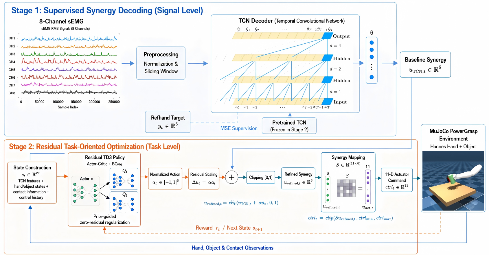
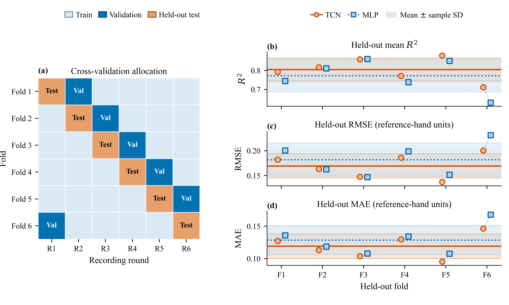
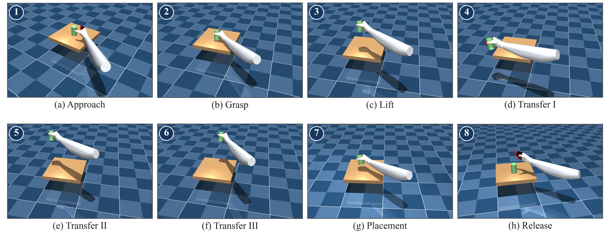
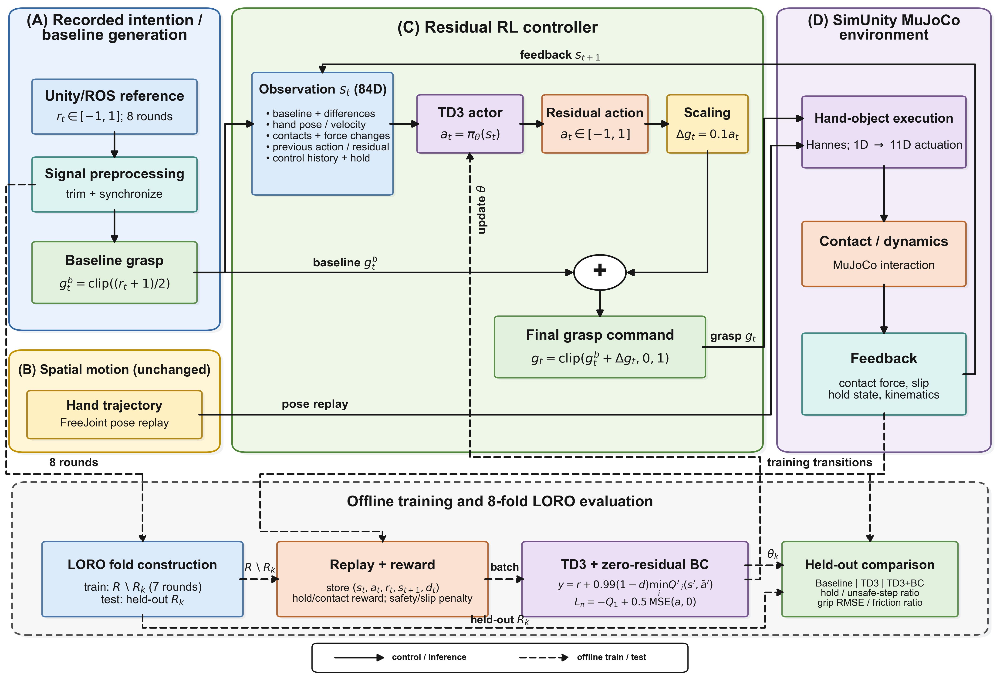
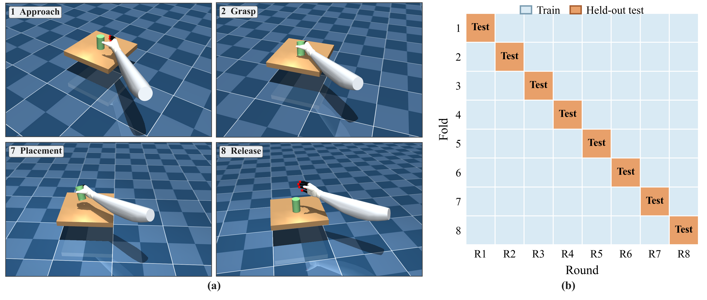
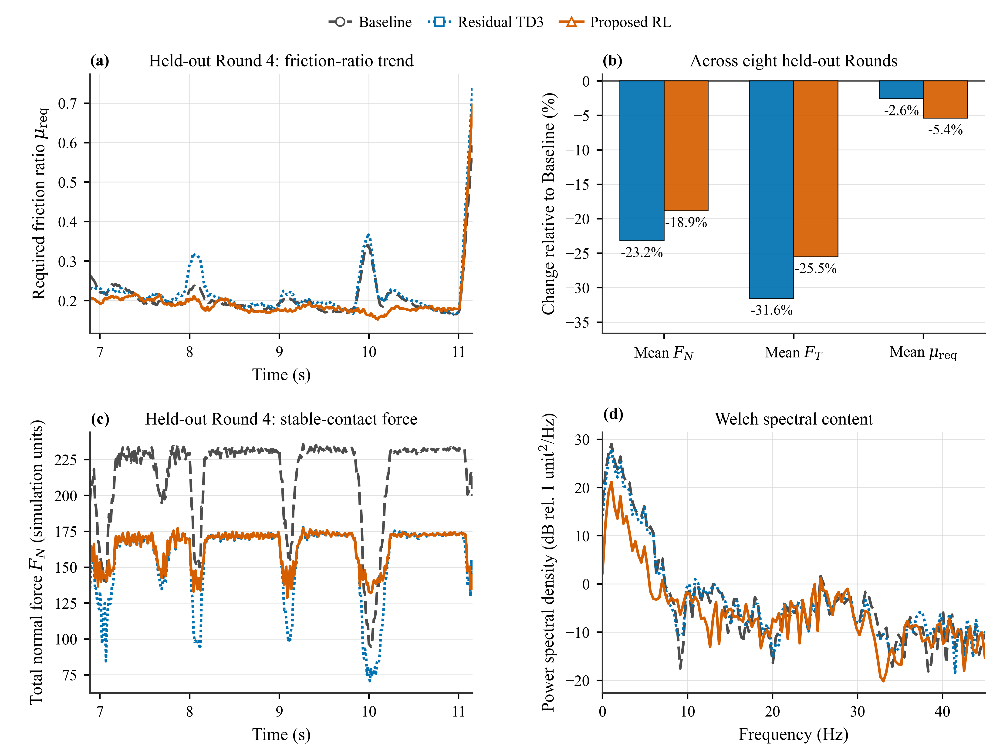

# A Two-Stage Synergy-Based Control Framework for sEMG-Driven Grasping with Residual Reinforcement Learning

**Shiwei Chen · Master's Thesis Research Demo**

M.Sc. in Electronic Engineering, University of Bologna  
Laboratory of Automation and Robotics (LAR)  
Supervised by Prof. Roberto Meattini  
Expected graduation: October 2026

**Research areas:** Robotics · Dexterous Manipulation · Artificial Intelligence · Reinforcement Learning · Shared Autonomy · Embedded Systems

## Project Overview

This thesis investigates how a dexterous robotic hand can use human muscle activity as its primary control input while learning to improve grasp execution. The framework combines **supervised intention decoding** with **bounded, contact-aware residual reinforcement learning**. A zero-residual regularizer encourages the learned controller to improve the task with limited modification of the human-derived command.

The research progresses from six-dimensional synergy decoding and grasp optimization to adaptation of the residual-control principle to an existing one-dimensional PowerGrasp laboratory interface. This page follows that progression through eight selected figures.

> Public research showcase for an ongoing Master's thesis. The repository presents the method and selected results; the complete implementation, datasets, and trained models remain private.

## My Contributions

My work in this thesis includes the design and implementation of the two-stage control framework, the MLP/TCN decoding experiments, the residual TD3 and zero-residual regularization method, the MuJoCo task reconstruction and controller integration, and the quantitative evaluation and analysis. The one-dimensional sEMG-to-PowerGrasp regression model and the associated Unity/ROS interface were existing components of the laboratory platform and were integrated into the proposed residual-control study.

## 1. Research Motivation and Human Input

Continuous sEMG regression can estimate a grasp command, but accurate signal reconstruction alone does not ensure stable object contact or appropriate grasping force. Task execution also depends on hand dynamics, contact transitions, and object motion. The research question is therefore: **how can task feedback improve grasping while retaining the decoded human command as the control baseline?**

The framework assigns complementary roles to its two stages:

- **Signal level:** decode eight-channel sEMG into a continuous, low-dimensional control representation.
- **Task level:** use hand, object, contact, force, and holding feedback to learn bounded corrections around that representation.

  

<strong>Figure 1.</strong> Wearable forearm sEMG interface. Muscle activity supplies the human-side signal for continuous grasp control.

## 2. Two-Stage Control Framework

A Temporal Convolutional Network (TCN) generates the six-dimensional baseline synergy command. A residual TD3 policy then adjusts individual synergy components using task feedback. The refined command is mapped through a predefined linear mapping to the eleven-dimensional actuator interface of the simulated Hannes Hand.

  

<strong>Figure 2.</strong> Supervised sEMG-to-synergy decoding followed by residual task optimization. The pretrained decoder remains fixed during residual-policy learning. The TCN schematic is simplified; architectural references are provided in the thesis.

The central design combines three elements:

- **Low-dimensional residual actions:** the policy refines the synergy command before actuator mapping.
- **Bounded intervention:** action scaling and command clipping limit the correction; zero residual recovers the executable baseline.
- **Zero-residual regularization:** an Actor-loss penalty discourages unnecessarily large corrections. Its reference is the zero residual, so it requires no expert-action demonstrations for this regularization term.

This separates supervised reference tracking from task-oriented policy learning while keeping an explicit baseline throughout execution.

## 3. Stage 1 — Supervised Synergy Decoding

The decoding study compares a multilayer perceptron (MLP) with a causal TCN using the same eight-channel sEMG inputs and six-dimensional RefHand targets. Both models receive a window of signal history. The MLP flattens this window, while the TCN uses causal temporal convolutions to model its sequential structure.

Evaluation uses **six recording rounds**. In each fold, four complete rounds are used for training, one for validation, and one for held-out testing. Normalization statistics are fitted on the training rounds, and model selection uses the validation round.

  

<strong>Figure 3.</strong> Round-level data separation and held-out decoding performance. Complete sequences remain within their assigned split.

The TCN achieves lower average RMSE and MAE, higher average R², and lower fold-to-fold variability than the MLP. It is therefore selected to supply the baseline synergy sequences for the subsequent six-dimensional grasp-control experiment.

## 4. Stage 2 — Six-Dimensional Residual Grasp Optimization

The second stage uses the six-dimensional TCN-generated synergy sequences corresponding to the PowerGrasp trials. The baseline executes the decoded synergy command directly. The proposed controller, denoted **TD3BCReg** in the thesis, adds a bounded six-dimensional residual and uses zero-residual regularization during training.

The task spans approach, grasp establishment, lifting, transfer, placement, and release, allowing evaluation across both sustained holding and contact transitions.

  

<strong>Figure 4.</strong> Complete manipulation sequence used to illustrate the MuJoCo grasping task.

The six-round results reported in Chapter 7 show longer stable holding, fewer unsafe-force events, lower excessive-force penalties, and slightly lower control cost under residual control. The corrections vary across synergy dimensions while retaining the main activation, holding, and release pattern of the TCN baseline.

These task improvements accompany increased deviation from the RefHand reference and greater temporal variation. This illustrates the distinction between reproducing a reference signal and optimizing its physical execution. The six-dimensional experiment evaluates algorithmic feasibility on the six available task rounds; it does not constitute held-out policy-generalization evaluation. Held-out-round evaluation is introduced in the subsequent one-dimensional study.

## 5. Adaptation to a Real-sEMG-Driven PowerGrasp Interface

Chapter 8 adapts the residual-control principle to an existing laboratory interface. Here, the baseline is a **one-dimensional PowerGrasp command generated by the laboratory regression model**. The six-dimensional TCN decoder belongs to the preceding experiment.

During acquisition, an eight-channel sEMG armband provides muscle-activity signals, which are processed by the existing laboratory regression model to generate a one-dimensional grasp-intensity command. A motion-tracked handheld controller independently supplies the virtual hand's position and orientation in Unity. Eight complete task rounds are recorded and reconstructed in MuJoCo.

  

<strong>Figure 5.</strong> One-dimensional system adaptation: synchronized human-generated inputs, scalar residual grasp correction, and physics-based hand–object interaction.

The residual policy adjusts only grasp intensity. Recorded spatial hand motion and wrist commands remain external inputs. The object is initialized from its recorded starting pose and then evolves under MuJoCo dynamics and contact, allowing controller-dependent grasp outcomes.

The one-dimensional implementation also uses continuous intention gating of positive contact and holding rewards: their contribution decreases as the baseline command approaches release. This reward design is shared by both residual controllers in the regularization comparison.

### Held-Out Evaluation

The experiment uses **eight-fold leave-one-round-out (LORO) evaluation**. Each fold trains on seven rounds and reserves the remaining complete round for testing. Checkpoint selection uses the training rounds; the held-out round is excluded from both policy optimization and checkpoint selection.

  

<strong>Figure 6.</strong> Representative manipulation phases and the complete-round LORO protocol for the one-dimensional experiment.

Three conditions are compared: **Baseline**, **Residual TD3** without zero-residual regularization, and **Proposed RL** with that regularization. For each test round, all conditions use the same recorded hand trajectory, wrist inputs, initial object state, simulation model, and time alignment. The two residual methods share the remaining training configuration and reward formulation.

## 6. Held-Out Results and Contact Analysis

### Grasp Performance and Baseline Preservation

  

<strong>Figure 7.</strong> One-dimensional controller comparison across eight held-out rounds. Each round contributes equally to the reported mean and sample standard deviation.

The main findings are:

- **Grasp maintenance:** Proposed RL achieves the highest average stable-hold proportion, increasing from 0.5324 for the Baseline to 0.5565.
- **Force safety:** both residual methods substantially reduce unsafe-step exposure. Residual TD3 has the lowest unsafe-step ratio; Proposed RL retains a large improvement over the Baseline.
- **Baseline preservation:** Proposed RL reduces baseline-deviation RMSE from 0.0787 to 0.0614 compared with Residual TD3, approximately a 22% reduction.
- **Contact balance:** Proposed RL achieves the lowest average valid-contact tangential-to-normal force ratio among the three conditions.

Here, hold ratio is the fraction of time spent in the defined stable-holding state. Baseline-deviation RMSE measures modification of the grasp command, separately from the decoding error evaluated in Stage 1.

### Force Evolution and Friction Demand

  

<strong>Figure 8.</strong> Contact analysis: held-out Round 4 illustrates friction-demand and force trajectories; the cross-round summary shows relative changes; Welch spectra describe the representative force signal.

Residual TD3 produces larger reductions in absolute contact-force magnitude. Proposed RL retains more normal-force support while reducing tangential-force demand, yielding a lower average required friction ratio. Its representative force trace also shows fewer deep transient drops than Residual TD3, and the spectral comparison indicates reduced additional fluctuation in parts of the spectrum.

Together, these results support a balance between task improvement, limited baseline modification, and contact-force regulation. The tangential-to-normal force ratio describes simulated friction demand; it is distinct from a measured material friction coefficient.

## 7. Research Scope and Outlook

The thesis establishes a progressive result: temporal modeling improves continuous synergy decoding; bounded residual learning improves execution of that baseline; and the residual principle can be adapted to a different baseline model and action space with held-out task-round evaluation.

The current evidence is based on physics simulation, including reconstructed real human-generated inputs in the one-dimensional study. The six-dimensional and one-dimensional experiments use different protocols and are interpreted separately. Physical-hand validation, cross-user and cross-day evaluation, broader object and grasp diversity, and multimodal tactile/visual feedback are the next research directions.

## Availability

This repository contains the research overview and eight selected figures. The full source code, human-recorded datasets, model checkpoints, and detailed experimental artifacts remain private while the thesis research is ongoing. Formal thesis and publication references will be added when available.

**Author:** [Shiwei Chen](https://github.com/Shiwei-Chen0415)
