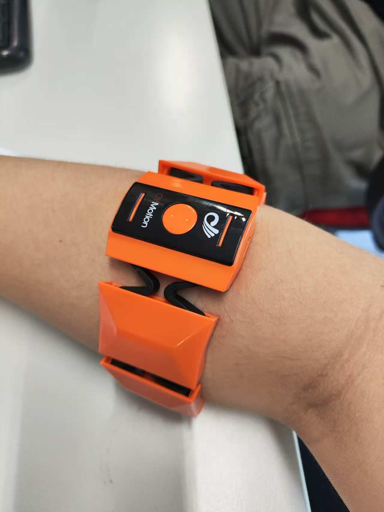
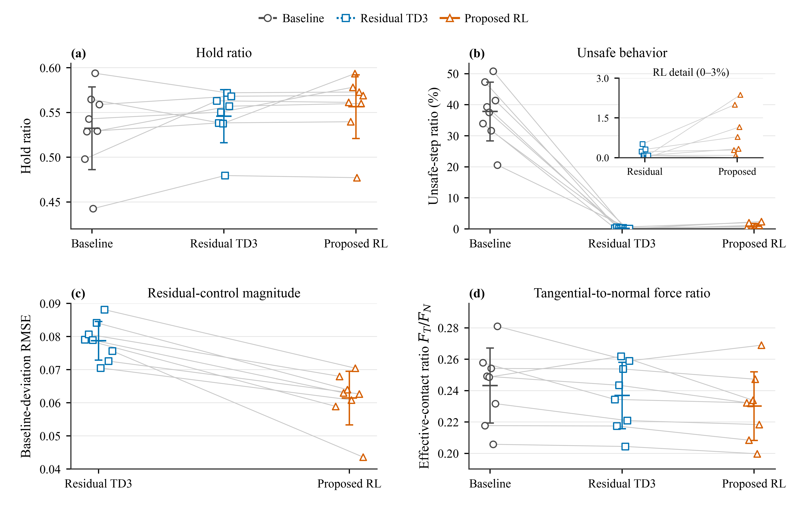

# Human-Intent-Preserving Residual Control for Robotic Grasping

This project investigates how human muscle activity and recorded hand motion can be translated into adaptive robotic grasping while keeping the human-generated command at the center of the control loop. A causal intention decoder provides the reference behavior, and a bounded residual reinforcement-learning controller makes only local, contact-aware corrections during simulated manipulation with the Hannes robotic hand.

> **Public research showcase.** This repository is intended as a visual and conceptual overview of an ongoing Master's thesis project. It presents selected descriptive figures without distributing participant-related recordings, raw or processed datasets, model checkpoints, internal experiment configurations, or detailed implementation code.

## Overview

Human intention signals are informative but imperfect as direct robot commands. Muscle activity varies over time and across recording sessions, while stable grasping also depends on contact geometry, object motion, and interaction forces that are not fully observable from the human input alone.

### Wearable sEMG interface

Forearm muscle activity is acquired through a wearable multichannel surface-electromyography sensor. The non-invasive interface provides the human-side input to the intention-decoding stage while leaving the downstream controller responsible for adapting the decoded command to simulated hand-object interaction.

<p align="center">
  
</p>

<p align="center"><sub>Wearable sEMG interface used to capture forearm muscle activity for intention decoding.</sub></p>

The project addresses this mismatch with a two-stage design:

1. A causal temporal model decodes multichannel surface electromyography (sEMG) into a compact hand-synergy reference.
2. A residual controller observes the reference together with simulated hand, object, and contact feedback, then applies a bounded correction before the command is mapped to the robotic hand.

The learned controller therefore augments the human-derived command instead of replacing it.

<p align="center">
  
</p>

<p align="center"><sub>Complete project framework: causal intention decoding provides the baseline command, while residual reinforcement learning introduces a constrained task-level correction using simulated interaction feedback.</sub></p>

## System Concept

The central control flow is:

```text
Human input -> causal intention decoding -> baseline hand command
            -> bounded residual correction -> robotic-hand actuation
            -> contact and motion feedback -> residual controller
```

The system is organized around four principles:

- **Human-command preservation.** The decoded or recorded intention remains an explicit baseline throughout the control pipeline.
- **Local adaptation.** The reinforcement-learning policy acts in residual space, limiting its authority to a correction around the baseline.
- **Contact-aware control.** Hand state, object motion, contact state, and force feedback provide task-level information that is unavailable from sEMG alone.
- **Regularized behavior.** The policy is encouraged to avoid unnecessary corrections, supporting a direct interpretation of the residual as the intervention introduced by the learned controller.

## Demonstrated Manipulation Task

The simulated task covers a complete manipulation sequence rather than an isolated closing motion. The Hannes hand approaches the object, establishes a grasp, lifts and transfers it, places it at the target location, and releases it.

<p align="center">
  
</p>

<p align="center"><sub>Representative task sequence in the MuJoCo environment: approach, grasp, lift, transfer, placement, and release.</sub></p>

## Complementary Recorded-Motion Study

A complementary experimental path evaluates residual grasp control using motion references recorded through a Unity/ROS workflow. The spatial hand trajectory is replayed as the human-provided motion reference, while the learned policy modifies only the grasp component. This separation makes it possible to study task-level adaptation without allowing the controller to rewrite the demonstrated spatial motion.

<p align="center">
  
</p>

<p align="center"><sub>Recorded-motion study: reference generation, unchanged spatial replay, residual grasp control, simulated contact dynamics, and round-level evaluation.</sub></p>

## Evaluation Design

Evaluation is organized at the recording-round level. In leave-one-round-out evaluation, one complete recording is reserved for testing while the remaining recordings are used for training. Repeating this process across rounds keeps each test trajectory separate from the data used to fit its corresponding controller and avoids randomly mixing neighboring temporal samples between training and evaluation.

<p align="center">
  
</p>

<p align="center"><sub>Left: representative phases of the simulated grasping task. Right: round-disjoint leave-one-round-out evaluation.</sub></p>

## Representative Results

The figures below provide a compact visual summary of the current experimental evidence. They are included to communicate the evaluation logic and the observed behavior of the system; the underlying recordings, per-round result files, and complete numerical tables are not part of this public showcase.

### Intention-decoding evaluation

The first-stage figure combines the round-level cross-validation allocation with held-out decoding measures for the causal temporal model and an MLP reference model. It visualizes variation across recording rounds together with descriptive aggregate summaries. The comparison should not be interpreted as a statistical-significance claim or as an isolated architecture-only ablation.

<p align="center">
  
</p>

<p align="center"><sub>Round-disjoint evaluation of the sEMG intention-decoding stage. Points show held-out folds, while the horizontal summaries provide a descriptive view across rounds.</sub></p>

### Held-out residual-control comparison

The second-stage comparison examines stable-hold time, unsafe-step time, residual-control magnitude, and contact-force balance across held-out rounds. The visualization shows how the learned residual controllers change task behavior relative to the recorded baseline, and how regularization affects the size of the intervention. Stable-hold time is reported as a time proportion and should not be read as an object-level grasp-success rate.

<p align="center">
  
</p>

<p align="center"><sub>Descriptive held-out comparison of the baseline, residual TD3, and the proposed behavior-regularized residual controller.</sub></p>

### Contact-force, friction, and spectral behavior

Contact-level analysis complements the task measures by examining normal and tangential force, their ratio during valid contact, and the frequency content of force variation. The time-series panels illustrate one held-out round, while the aggregate panel summarizes changes across held-out rounds. These simulation measures characterize controller behavior; they are not presented as proof of physical slip boundaries, real-world safety, or statistical significance.

<p align="center">
  
</p>

<p align="center"><sub>Representative friction-ratio and stable-contact behavior, descriptive force changes across held-out rounds, and Welch spectral analysis.</sub></p>

## Research Questions

This work is structured around three questions:

- Can causal temporal learning recover a useful low-dimensional hand command from multichannel sEMG?
- Can a bounded residual policy adapt that command using contact and dynamics feedback while preserving the underlying human intention?
- Can the resulting control strategy be evaluated on complete held-out recording rounds rather than temporally mixed samples?

The analysis considers grasp retention, unsafe contact behavior, force interaction, deviation from the human-derived baseline, and control smoothness. Selected figures are shown here at a descriptive level; exact values, full statistical context, and additional analyses remain part of the thesis and associated research outputs.

## Research Scope

The project connects several areas of robotics and machine learning:

| Area | Role in the project |
|---|---|
| Human intention decoding | Causal modeling of multichannel sEMG and recorded control references |
| Dexterous manipulation | Low-dimensional coordination of the Hannes robotic hand |
| Residual reinforcement learning | Task-aware corrections around a human-derived baseline |
| Contact-rich simulation | Hand-object dynamics and force feedback in MuJoCo |
| Human-centered control | Preserving operator intent while adding autonomous assistance |
| Generalization assessment | Evaluation on complete recording rounds held out from training |

## Public Release Boundary

This showcase is intentionally limited to material suitable for public academic review.

**Included**

- High-level research motivation and system description
- Full architecture and task-sequence figures
- Conceptual evaluation design
- Selected descriptive result figures
- A clear statement of the research scope and limitations

**Not publicly distributed**

- Raw or processed human recordings and participant-related metadata
- Private datasets or internal laboratory material
- Training, evaluation, and preprocessing source code
- Detailed hyperparameters, reward settings, and experiment-by-experiment procedures
- Model checkpoints and large generated artifacts
- Credentials, local paths, or private infrastructure information
- Per-round result artifacts, complete numerical tables, and unpublished ablations
- Third-party assets without redistribution permission

## Status and Responsible Use

This is an ongoing Master's thesis project and a simulation-focused research prototype. It is not validated for clinical, safety-critical, or autonomous real-world deployment. The visual material demonstrates the research architecture and experimental design; it should not be interpreted as a claim of deployment readiness or as a substitute for the complete thesis methodology.

## Citation

Formal citation information will be added after the associated thesis or publication is publicly available. Until then, please contact the author before reusing figures or describing unpublished aspects of the work.
